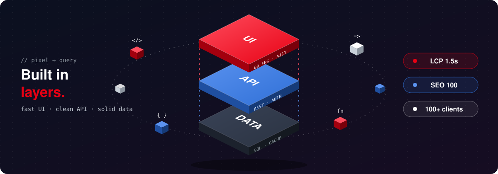

<!-- ═══════════════════════  HEADER  ═══════════════════════ -->
<div align="center">



<a href="https://github.com/kamelbenanaya">
  
</a>

<br/>

<a href="https://linkedin.com/in/kamel-ben-anaya"></a>
<a href="mailto:kamel.benanaya001@gmail.com"></a>


</div>

<br/>

<!-- ═══════════════════════  ABOUT  ═══════════════════════ -->
## ☪️ `whoami`

```ts
const kamel = {
  origin:      "🇹🇳 Sousse, Tunisia — where the Med meets the medina",
  role:        "Senior Frontend / Fullstack JavaScript Developer",
  experience:  "7+ years building for the web · ~4 years deep in React & Next.js",
  craft:       ["App Router & RSC", "Core Web Vitals", "Multi-tenant SaaS", "Design systems"],
  backend:     ["NestJS", "Prisma", "PostgreSQL", "Redis", "Docker"],
  superpower:  "AI-integrated engineering — Claude Code · Cursor · Copilot",
  speaks:      ["تونسي (Darija)", "Français", "English", "Deutsch (B1, wachsend 📈)"],
  fuel:        "Tunisian coffee ☕ + a little harissa 🌶️",
};
```

> *I build interfaces the way Sidi Bou Said is painted — clean white structure, sharp blue details, and nothing out of place.*

---

<!-- ═══════════════════════  STACK  ═══════════════════════ -->
## 🧰 Toolbox

<div align="center">



<br/>

**Frontend**
<br/>


**Backend & Data**
<br/>


**Workflow**
<br/>


<br/>


</div>

---

<!-- ═══════════════════════  PROJECTS  ═══════════════════════ -->
## 🏛️ Featured Work

<table>
<tr>
<td width="50%" valign="top">

### 💳 Bitaqa.tn
Multi-tenant **NFC digital business card SaaS**, designed and built solo.
<br/>
`Next.js` `TypeScript` `Prisma` `PostgreSQL`
<br/><br/>
🏢 **100+ corporate clients** served

</td>
<td width="50%" valign="top">

### 🩺 Elfaraj.tn
**Next.js 15** e-commerce storefront for medical equipment, obsessively tuned for speed.
<br/>
`Next.js 15` `React` `SEO`
<br/><br/>
⚡ Lighthouse **Perf 91 · SEO 100** · LCP **1.5s**

</td>
</tr>
<tr>
<td width="50%" valign="top">

### 🏠 THARWAH · ثروة
Saudi **PropFinTech** platform connecting home buyers, banks & agencies — evolved into a **white-label multi-tenant SaaS**. Technical co-founder.
<br/>
`NestJS` `Next.js` `Prisma`

</td>
<td width="50%" valign="top">

### 🌉 Arrowgate.de
Bilingual **Tunisia ↔ Germany talent-matching platform** — building bridges across the Mediterranean, one match at a time.
<br/>
`Next.js` `i18n` `TypeScript`

</td>
</tr>
</table>

---

<!-- ═══════════════════════  STATS  ═══════════════════════ -->
## 📊 Commits from the Coast

<div align="center">

<sub>🔒 Most of my work lives in private client repositories — contributions below include them, code stays confidential.</sub>

<br/><br/>


</div>

---

<!-- ═══════════════════════  PRINCIPLES  ═══════════════════════ -->
## 🌶️ House Rules (Tunisian Edition)

| | |
|---|---|
| 🧱 **Build like Carthage** | Architecture that outlasts the sprint. |
| 🎨 **Paint like Sidi Bou Said** | Clean, consistent, accessible UI — blue & white, no clutter. |
| 🫒 **Grow like an olive tree** | Small, steady improvements; ship every week. |
| 🌶️ **Season like harissa** | A touch of delight in every interaction — never too much. |
| 🤖 **Pair with AI, own the code** | AI accelerates, I review, test, and take responsibility. |

---

<div align="center">

### 🤝 Open to senior frontend & fullstack roles — remote or 🇩🇪 Germany

*Got a React/Next.js product that needs to be fast, beautiful and scalable? Let's talk.*

<br/>


</div>
